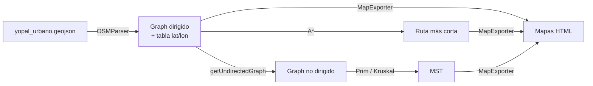

# Optimización de Rutas de Emergencia — Yopal, Casanare

**Proyecto 1 — Ciencias de la Computación II · Grupo 4**

Sistema que modela la red vial del casco urbano de Yopal como un **grafo** y usa
**A\*** (caminos más cortos) y **Árbol de Recubrimiento Mínimo / MST** (Prim y
Kruskal) para:

1. Encontrar la ruta más rápida entre un accidente y el punto crítico (hospital,
   bomberos, policía) más cercano.
2. Proponer dónde ubicar estaciones de emergencia.
3. Comparar la eficiencia de atender cada punto por separado vs. una red única
   de patrullaje.

---

## 1. El problema

En una emergencia lo que importa es el **tiempo de respuesta**. Dado:

- La **red de calles** de Yopal (de OpenStreetMap), con intersecciones y sentidos.
- Unos **puntos críticos** (estaciones: hospital, bomberos, policía).
- Un **accidente** en algún punto de la ciudad.

Queremos responder: ¿cuál estación llega más rápido y por qué ruta?, ¿dónde
convendría poner nuevas estaciones?, ¿y qué tan eficiente es conectar todo con un
MST frente a rutas individuales?

### Dataset

- Origen: exportación de **Overpass Turbo** (OpenStreetMap) → `src/Data/export.geojson`.
- Recortado al casco urbano de Yopal (bounding box `lat 5.31–5.37`, `lon -72.44 – -72.37`)
  → **`src/Data/yopal_urbano.geojson`** (2088 calles tipo `LineString`).
- El parser además **filtra** las vías no aptas para vehículos (andenes, ciclorrutas…).

---

## 2. Arquitectura general

```
src/
├── Model/         → estructuras de datos del grafo
│   ├── Graph.java          (interfaz)
│   ├── AdjacencyList.java  (implementación con listas de adyacencia)
│   ├── Edge.java           (arista: origen, destino, peso, sentido)
│   └── Node.java           (vértice + distancia, para la cola de Prim)
├── Algorithms/    → los algoritmos del proyecto
│   ├── AStar.java          (ruta más corta punto a punto)
│   ├── Prim.java           (MST)
│   └── Kruskal.java        (MST)
├── IO/            → entrada/salida
│   ├── OSMParser.java      (GeoJSON  → Graph)
│   └── MapExporter.java    (Graph → mapas HTML con Leaflet)
├── App/
│   └── Main.java           (menú por consola que conecta todo)
└── Data/
    ├── yopal_urbano.geojson
    └── historial_accidentes.csv   (se genera al simular accidentes)
mapas/              → mapas HTML exportados (se crean al ejecutar)
```

### Flujo de datos



**Idea clave:** el `Graph` solo entiende vértices enteros `0..n-1`. El `OSMParser`
guarda aparte la traducción `índice → (lat, lon)`, que es lo que permite calcular
distancias reales y dibujar los mapas.

---

## 3. El Modelo (`Model/`)

Es la capa de estructuras de datos: define **qué es un grafo** en el proyecto,
independiente de las calles o los algoritmos.

### 3.1 `Graph` (interfaz)

Contrato que cualquier grafo debe cumplir. Trabaja **solo con enteros** (los
vértices son `0..n-1`):

```java
int vertexCount();                 // cuántos vértices
int edgeCount();                   // cuántas aristas
boolean isDirected();              // ¿respeta el sentido?
Edge addEdge(int src, int dst);            // arista peso 1
Edge addEdge(int src, int dst, double w);  // arista con peso
ArrayList<Edge>    edges();        // todas las aristas
ArrayList<Edge>    edgesOf(int v); // aristas que salen de v
ArrayList<Integer> neighbors(int v);
```

**Para qué sirve:** desacopla los algoritmos de la implementación concreta. A\*,
Prim y Kruskal reciben un `Graph`, no les importa si por dentro es lista o matriz.

### 3.2 `AdjacencyList` (implementación)

Implementa `Graph` con **listas de adyacencia**: por cada vértice, una lista de
`AdjEntry(vecino, arista)`.

- Se construye con `new AdjacencyList(n, directed)`.
- `addEdge(u, v, w)`: crea un `Edge` y lo agrega a la lista de `u`. **Si el grafo
  es NO dirigido**, también lo agrega a la lista de `v` (misma arista en ambos
  sentidos). Si es dirigido, solo `u → v`.
- Guarda además un `edgeList` global (para recorrer todas las aristas de una).

**Por qué listas y no matriz:** el grafo de Yopal tiene ~5.500 vértices; una
matriz sería de 5.500 × 5.500 ≈ 30 millones de celdas casi todas vacías. Las
listas solo guardan las aristas que existen.

### 3.3 `Edge` (arista)

Representa una calle (o tramo) entre dos vértices:

```java
int id, source, destination;
double weight;      // peso = distancia real en metros (Haversine)
boolean oneway;     // true = solo se puede ir source → destination
```

Métodos útiles:
- `getOther(v)`: dado un extremo, devuelve el otro (`-1` si `v` no pertenece).
  Lo usan A\* y Prim para "seguir" la arista sin importar la dirección.
- `directionLabel()`: `"unidireccional"` / `"bidireccional"` para reportes.

### 3.4 `Node` (vértice + distancia)

`Node(vertice, distance)` que implementa `Comparable`: se ordena por `distance`.
Sirve exclusivamente para la **cola de prioridad de Prim**, que necesita sacar
siempre el vértice más "barato" de conectar.

---

## 4. Entrada/Salida (`IO/`)

### 4.1 `OSMParser` — de GeoJSON a grafo

Es el corazón de la carga. En el constructor `new OSMParser(ruta)` hace **dos
pasadas** sobre el archivo:

**Pasada 1 — recolectar vértices y tramos:**

1. Recorre cada *feature* del GeoJSON.
2. Se queda solo con geometrías `LineString`/`MultiLineString` (las calles).
3. **Filtro vehicular:** lee la etiqueta `highway`. Si NO está en el conjunto
   `CALLES_VEHICULOS` (`primary, secondary, tertiary, residential, service,
   unclassified, living_street, trunk, motorway` y sus `_link`), **descarta la
   vía** — así una ambulancia no rutea por andenes, ciclorrutas ni senderos.
4. Lee el sentido con la etiqueta `oneway` (`yes/1/true` = sentido único;
   `-1` = sentido invertido; ausente = doble sentido).
5. Convierte cada coordenada `(lon, lat)` en un vértice entero. Para que dos
   calles que se cruzan compartan el **mismo** vértice, redondea la coordenada a
   **7 decimales** (~1 cm) y usa un mapa `"lon,lat" → índice`. Así aparecen solas
   las intersecciones.

**Pasada 2 — construir el grafo:**

- Crea un `AdjacencyList` **dirigido**.
- Por cada tramo agrega la arista con peso = **distancia Haversine en metros**.
  - Si es `oneway`: una sola arista `u → v`.
  - Si es doble sentido: dos aristas (`u → v` y `v → u`).

Métodos que ofrece a los demás:

| Método | Para qué |
|---|---|
| `getGraph()` | grafo **dirigido** (respeta sentidos) → lo usa A\* |
| `getUndirectedGraph()` | grafo **no dirigido** (ignora `oneway`, sin duplicados) → lo usa el MST |
| `getLat(i)` / `getLon(i)` | coordenada real del vértice `i` |
| `heuristicTo(goal)` | arreglo con la distancia recta de cada vértice al destino → heurística de A\* |
| `nearestVertex(lat, lon)` | vértice más cercano a una coordenada (para anclar críticos/accidentes) |
| `getOnewayStreetCount()`, `getTwoWayStreetCount()`, `getDiscardedWayCount()` | métricas |
| `haversine(...)` (estático) | distancia en metros entre dos coordenadas geográficas |

> **Dirigido vs. no dirigido:** para mover una ambulancia el sentido **sí**
> importa (A\* usa el dirigido). Para el MST, que solo mide qué tan conectada
> está la zona, el sentido **no** importa (usa el no dirigido). Por eso el parser
> ofrece las dos versiones.

### 4.2 `MapExporter` — de grafo a mapas HTML

Genera archivos `.html` autocontenidos que usan **Leaflet + OpenStreetMap** para
ver el resultado en el navegador. Tiene tres métodos según lo que se quiera pintar:

| Método | Qué dibuja |
|---|---|
| `exportar(html)` / `exportar(html, mst)` | El grafo en gris + (opcional) el **MST en rojo**. Al hacer clic muestra la coordenada. |
| `exportarSimulacion(html, mst, criticos, nombres, accLat, accLon, ruta)` | Grafo gris + **MST rojo** debajo + **ruta más corta en azul** + **críticos verdes** + **accidente rojo grande**. |
| `exportarUbicaciones(html, estaciones, etiquetas, accidentes)` | Grafo gris + **accidentes (puntos naranjas)** + **estaciones sugeridas (marcadores azules)**. |

El orden de dibujo importa: lo menos relevante (grafo, MST) va abajo y la ruta
azul + los marcadores encima, para que siempre se vean.

---

## 5. Los algoritmos (`Algorithms/`)

### 5.1 A\* — ruta más corta punto a punto

`AStar.search(start, goal, heuristic)` devuelve la lista de vértices de la ruta
óptima (o `null` si no hay camino).

- Es Dijkstra **guiado por una heurística**: en vez de explorar en todas las
  direcciones, prioriza los vértices que parecen acercarse al destino.
- `f(v) = g(v) + h(v)`, donde `g` = costo real acumulado y `h` = estimación al
  destino (la distancia recta Haversine de `heuristicTo(goal)`).
- Como la distancia recta **nunca sobreestima** la distancia real por calles, la
  heurística es *admisible* → A\* garantiza la ruta óptima.
- Corre sobre el grafo **dirigido**, así que respeta los sentidos únicos.

**Dónde se usa:** opción 3 (accidente → cada crítico) y opción 5 (distancias
entre puntos de interés).

### 5.2 Prim — Árbol de Recubrimiento Mínimo

`Prim.primAlgorithm(graph)` devuelve la lista de aristas del MST.

- Hace crecer el árbol desde un vértice, agregando siempre la **arista más barata**
  que conecta un vértice nuevo, usando una **cola de prioridad** (`Node`).
- Recorre todos los vértices como posibles semillas, así que también funciona si
  el grafo está **desconectado** (devuelve un *bosque*).

### 5.3 Kruskal — Árbol de Recubrimiento Mínimo

`Kruskal.kruskalAlgorithm(graph)` — misma meta, otra estrategia:

- Ordena **todas** las aristas por peso y las va agregando de menor a mayor,
  saltando las que formarían ciclo.
- Detecta ciclos con **Union-Find** (`find` + `union` por rango).

> **Ambos dan un MST válido**; el proyecto deja elegir cuál usar. Se calculan
> siempre sobre el grafo **no dirigido**.

---

## 6. La aplicación (`App/Main.java`)

Menú por consola que conecta todas las piezas. Mantiene el estado en variables
"globales": el `parser` cargado, la lista de `criticos`, el `mstActual` y el
`ultimoAccidente`.

```
=== SISTEMA DE RUTAS DE EMERGENCIA - Yopal, Casanare ===
1. Cargar mapa y exportar el mapa con el MST en rojo
2. Registrar puntos criticos
3. Simular accidente
4. Ver metricas
5. Comparar rutas individuales vs MST (para el informe)
6. Sugerir ubicaciones de estaciones
0. Salir
```

### Opción 1 — Cargar mapa (+ MST)

1. Lista los `.geojson` de `src/Data` y deja **elegir cuál** (no está quemado Yopal).
2. Lo pasa por el `OSMParser` y muestra métricas de carga (vértices, aristas,
   sentidos, vías descartadas por el filtro).
3. Pregunta el algoritmo del MST (**Prim** o **Kruskal**), lo calcula sobre el
   grafo no dirigido y lo guarda en `mstActual`.
4. Exporta el mapa con el **MST resaltado en rojo** a `mapas/<archivo>_mapa.html`.

*(El spam de Prim/Kruskal se silencia temporalmente para no llenar la consola.)*

### Opción 2 — Registrar puntos críticos

Se ingresa nombre + coordenada de cada estación (hospital, bomberos, policía…).
Cada una se **ancla al vértice más cercano** con `nearestVertex` y se informa a
cuántos metros quedó de la coordenada escrita.

### Opción 3 — Simular accidente

1. El accidente se define **a mano** (coordenadas) o **aleatorio** (cualquier
   vértice del grafo).
2. Se registra en `historial_accidentes.csv` (lo usa la opción 6B).
3. Corre **A\*** desde el accidente hacia **cada** punto crítico y elige el de
   **menor distancia** → el más cercano.
4. Reporta distancia y **tiempo estimado de respuesta** (según la velocidad de
   ambulancia).
5. Exporta `mapas/simulacion_N.html` (numerado, no se sobrescribe) con críticos
   verdes, accidente rojo y la **ruta más corta en azul**, sobre el MST.

### Opción 4 — Métricas

Muestra: vértices, aristas, tramos uni/bidireccionales, **longitud total de la
red**, bounding box, lista de críticos y el resultado del **último accidente**
(distancia + tiempo).

### Opción 5 — Comparar rutas individuales vs MST *(para el informe)*

No afecta la simulación; produce números para el informe:

1. Calcula con A\* (sobre el grafo no dirigido) la **matriz de distancias** entre
   todos los puntos de interés.
2. **Estrategia individual (estrella):** elige el mejor "centro" (1-mediana) y
   suma las rutas de ese centro a cada punto.
3. **Estrategia MST:** MST sobre ese grafo completo de puntos → un solo recorrido
   que los conecta todos.
4. Reporta el costo total (km y min) de cada una, el **% de ahorro** del MST y la
   cobertura. *(El MST siempre es ≤ la estrella, porque es el árbol de conexión
   mínimo.)*

### Opción 6 — Sugerir ubicaciones de estaciones

Submenú con dos criterios:

- **6A · Por cobertura (k-centro / *farthest-first*):** pone la 1ª estación en el
  centro geográfico y cada siguiente en el vértice **más lejano** a las ya
  puestas → reparte `k` estaciones por toda la ciudad (triangulación). Reporta,
  por estación, cuántas intersecciones cubre y su radio máximo.
- **6B · Por historial de accidentes:** lee el CSV de accidentes, divide la ciudad
  en una **rejilla**, encuentra la celda con más accidentes y propone la estación
  en el centro de esa zona (donde más se necesita). Si no hay historial, ofrece
  generar accidentes de ejemplo.

Ambas exportan un mapa (`sugerencia_cobertura.html` / `sugerencia_historial.html`).

### Detalles de diseño en `Main`

- **Modelo de tiempo:** `tiempoMin(metros)` convierte distancia → minutos usando
  `VELOCIDAD_AMBULANCIA_KMH = 60`. Con velocidad constante, minimizar distancia
  equivale a minimizar tiempo, así que A\* ya da la ruta más rápida.
- **Robustez de entrada:** `leerEntero` / `leerDouble` reintentan ante datos
  inválidos y aceptan coma o punto decimal.
- **Sin tildes en consola:** para evitar el `MEN�` en la terminal de Windows.

---

## 7. Conceptos clave para la exposición

| Concepto | Decisión en el proyecto | Por qué |
|---|---|---|
| Grafo dirigido vs. no dirigido | A\* usa el dirigido; el MST el no dirigido | El sentido importa para conducir, no para medir conectividad |
| Peso de las aristas | Distancia real en metros (Haversine) | Es la magnitud física correcta sobre coordenadas geográficas |
| Tiempo de respuesta | `distancia / velocidad` con velocidad fija | Convierte distancia en la métrica que pide el problema |
| Filtro de vías | Solo calles vehiculares | Una ambulancia no circula por andenes/ciclorrutas |
| A\* óptimo | Heurística = distancia recta (admisible) | Garantiza el camino más corto |
| MST (Prim/Kruskal) | Sobre nodos/red no dirigida | El MST solo existe en grafos no dirigidos |
| Ubicación por cobertura | *farthest-first* en vez de cortar el MST | El corte del MST daba zonas desbalanceadas ("efecto cadena") |

---

## 8. Cómo compilar y ejecutar

Requiere **Java** y la librería **`org.json`** (usada por el parser) en el classpath.

```bash
# Compilar (ajusta la ruta al json.jar)
javac -encoding UTF-8 -cp "lib/json.jar" -d out $(find src -name "*.java")

# Ejecutar
java -cp "out;lib/json.jar" App.Main      # Windows (separador ;)
java -cp "out:lib/json.jar" App.Main      # Linux/Mac (separador :)
```

Flujo típico de demo: `1` (cargar) → `2` (registrar críticos) → `3` (simular
accidente) → abrir el `mapas/simulacion_1.html` → `5` y `6` para el informe.

---

## 9. Limitaciones y trabajo futuro

- **Puntos de interés manuales:** los críticos se ingresan por coordenada; no se
  cargan POIs (hospitales, comisarías) directamente desde OSM.
- **Velocidad constante:** el tiempo asume 60 km/h en toda la red. Se podría
  refinar con velocidad por tipo de vía (`highway`/`maxspeed`), y ahí el tiempo
  óptimo dejaría de coincidir con la distancia óptima.
- **Red dirigida y desconectada:** por los sentidos únicos, un accidente aleatorio
  puede no alcanzar a ningún crítico; el programa lo reporta honestamente.
- **k-centro con distancia recta:** la sugerencia por cobertura usa distancia en
  línea recta (rápida); usar distancia por calles daría radios más realistas.

---

*Proyecto académico — Grupo 4. Datos © OpenStreetMap contributors.*
